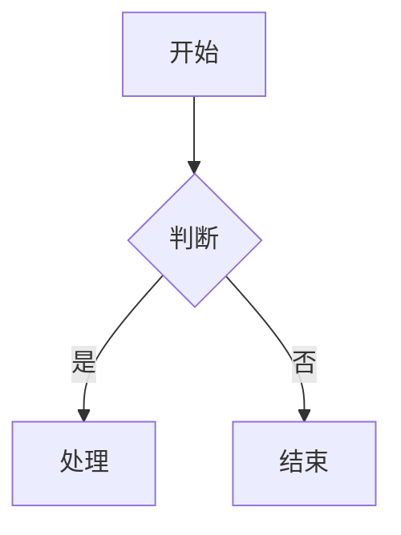
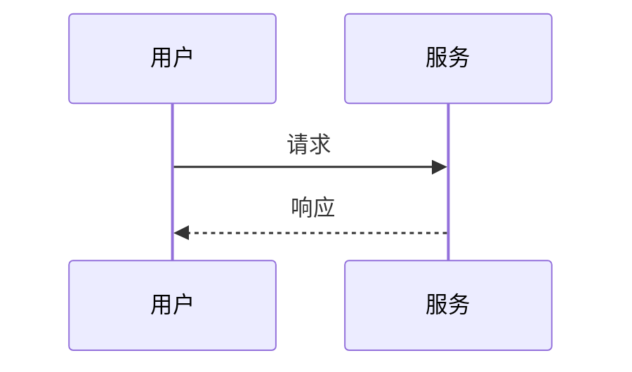

# 测试文档

## 流程图


```mermaid
graph TD
  A[开始] --> B{判断}
  B -->|是| C[处理]
  B -->|否| D[结束]
```

## 时序图


```mermaid
sequenceDiagram
  participant U as 用户
  participant S as 服务
  U->>S: 请求
  S-->>U: 响应
```

## 普通代码块

```js
console.log('hello');
```

## 图片


